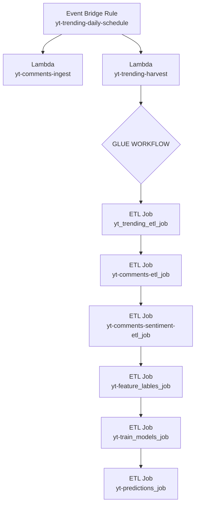

# Pipeline
The pipeline is started everyday at 6:00 am by an Event Bridge Rule.  That rule starts two lambda jobs, one that retrieves trending video data and one that retrieves comment data.  Then the trending Lambda function kicks off an ETL workflow.

# Schema for Curated Trending
Trending rows: 308  
root  
 |-- video_id: string (nullable = true)  
 |-- channel_id: string (nullable = true)  
 |-- category_id: string (nullable = true)  
 |-- title: string (nullable = true)  
 |-- description: string (nullable = true)  
 |-- tags: array (nullable = true)  
 |    |-- element: string (containsNull = true)  
 |-- default_lang: string (nullable = true)  
 |-- duration_iso: string (nullable = true)  
 |-- dimension: string (nullable = true)  
 |-- definition: string (nullable = true)  
 |-- caption: string (nullable = true)  
 |-- source_file: string (nullable = true)  
 |-- trending_date_raw: string (nullable = true)  
 |-- view_count: long (nullable = true)  
 |-- like_count: long (nullable = true)  
 |-- comment_count: long (nullable = true)  
 |-- published_at: timestamp (nullable = true)  
 |-- published_date: date (nullable = true)  
 |-- published_hour: integer (nullable = true)  
 |-- published_year: integer (nullable = true)  
 |-- published_week: integer (nullable = true)  
 |-- title_clean: string (nullable = true)  

 # Schema for Curated Comments
 Comments rows: 1950  
root  
 |-- video_id: string (nullable = true)  
 |-- author_display_name: string (nullable = true)  
 |-- comment_text: string (nullable = true)  
 |-- like_count: long (nullable = true)  
 |-- published_at: string (nullable = true)  

 ## Example

|video_id   |avg_comment_sent_neg|avg_comment_sent_pos|avg_comment_sent_neu|avg_comment_sent_mix|
|-----------|--------------------|--------------------|--------------------|--------------------|
|f9cmVvoff_E|0.1290064975633868  |0.6184878684580326  |0.24302935102023185 |0.009476289631675173|
|qyG8ECu6PLs|0.13254077191231772 |0.44734036531299354 |0.40611868315609173 |0.014000197085260879|
|NED7nev2ywQ|0.031510981127030394|0.5925639167428016  |0.3744591164619123  |0.001465997982495537|
|tunE9m6Capc|0.06637772248686816 |0.633051291294396   |0.2999355108127929  |6.354625917083468E-4|
|rq8ey7cKfYo|0.22030394608154893 |0.5516512870322913  |0.21202047837432475 |0.01602430955535965 |
|Mwh7WFCW3f8|0.031741421665356026|0.6489454314112664  |0.310721469996497   |0.008591670378518757|
|5VYsnngkS_U|0.2739665969493217  |0.4825845114886761  |0.22159542713779956 |0.02185346125988872 |
|ppp7dMhzrz8|0.11023588062089403 |0.29391645565629004 |0.570578235015273   |0.025269425720034634|
|LuJpdvb5bDk|0.2314167314907536  |0.2851702789310366  |0.43555228197947143 |0.04786071829439607 |
|sNHHfHIewpU|0.21364659490063787 |0.13959275853121653 |0.6237579956650734  |0.023002657078541232|

only showing top 10 rows

# Schema for Predicted Trending

Comments Sentiments rows: 38  
root  
 |-- video_id: string (nullable = true)  
 |-- channel_id: string (nullable = true)  
 |-- trending_date: date (nullable = true)  
 |-- title: string (nullable = true)  
 |-- view_count: long (nullable = true)  
 |-- like_count: long (nullable = true)  
 |-- comment_count: long (nullable = true)  
 |-- log_view_count: double (nullable = true)  
 |-- log_like_count: double (nullable = true)  
 |-- log_comment_count: double (nullable = true)  
 |-- pred_log_view_growth_next: double (nullable = true)  
 |-- pred_log_view_count_next: double (nullable = true)  
 |-- pred_view_count_next: double (nullable = true)  
 |-- pred_stay_trending_next: double (nullable = true)  
 |-- prob_stay_trending_next: double (nullable = true)  

 ## Example

|video_id   |view_count|like_count|pred_view_count_next|prob_stay_trending_next|
|-----------|----------|----------|--------------------|-----------------------|
|0UI_Gc7OYWc|288166    |null      |288165.99999999994  |1.0                    |
|1SLVqAlCIJ4|329474    |21214     |329473.9999999999   |1.0                    |
|1XZVp2pJ4_I|154142    |4546      |154142.00000000012  |1.0                    |
|5VYsnngkS_U|7946614   |71275     |7946614.000000003   |1.0                    |
|8pBYvVGi6XA|109171    |238       |109171.00000000007  |1.0                    |
|EzXdT-msTys|48524     |3536      |48523.999999999956  |1.0                    |
|F5EHH3oh4r8|41182     |5523      |41181.999999999985  |1.0                    |
|LuJpdvb5bDk|4239644   |395725    |4239643.999999999   |1.0                    |
|QKYFfYLe5rs|5120928   |39953     |5120927.999999999   |1.0                    |
|QTv_FrdBQ6A|116739    |7319      |116739.00000000001  |1.0                    |
|R0-N6j3-2B8|37137     |6830      |37137.0             |1.0                    |
|SKy55H4J23U|37285     |889       |37284.999999999985  |1.0                    |
|SqegozqKTJM|432613    |15384     |432613.0            |1.0                    |
|TN1roozMeAU|871581    |33161     |871581.0000000007   |1.0                    |
|Tjv3G5BfzKQ|349315    |4017      |349314.9999999999   |1.0                    |
|W1Co9UA8KtE|253822    |2212      |253821.99999999997  |1.0                    |
|X8Xj3hOyHX4|49765     |445       |49765.00000000002   |1.0                    |
|_Cid2xl6AyI|388871    |5973      |388871.0            |1.0                    |
|bt2YpDx2xdE|291024    |38243     |291023.99999999994  |1.0                    |
|c0-35eW9Zw0|62758     |134       |62757.99999999997   |1.0                    |
|cPiBkHE6Cwc|383549    |22602     |383548.99999999977  |1.0                    |
|dtWWS9kds3A|8489      |260       |8489.000000000005   |1.0                    |
|e6xy35omS1A|12014     |2961      |12014.000000000011  |1.0                    |
|etJCYw8J3u0|9110      |1843      |9110.000000000002   |1.0                    |
|fl2NwcZM4QE|89967     |2876      |89966.99999999993   |1.0                    |
|hV2TBa7-F3A|691999    |75712     |691998.9999999995   |1.0                    |
|iVXX7_Z2jx8|599250    |12840     |599249.9999999995   |1.0                    |
|ly8BG60LLXM|905522    |28770     |905522.0000000002   |1.0                    |
|nrt7Oz-eZSg|13173     |1344      |13172.999999999998  |1.0                    |
|nzUy0Q0KSmU|28070     |2706      |28070.00000000002   |1.0                    |
|o2ODGCjMzDw|83561     |859       |83560.99999999993   |1.0                    |
|ppp7dMhzrz8|653684    |36319     |653684.0000000001   |1.0                    |
|rpemGMWoCXA|352803    |13261     |352803.00000000023  |1.0                    |
|tBPR4sWvXJU|39118     |1153      |39118.00000000002   |1.0                    |
|wG1-cys0XXw|226805    |4701      |226805.0000000002   |1.0                    |
|x0NU-IRFCLc|202448    |6294      |202447.99999999988  |1.0                    |
|yGkjdQwzuSw|21333     |2213      |21333.000000000007  |1.0                    |
|ySJE71dxJoA|101015    |3021      |101015.0            |1.0                    |
